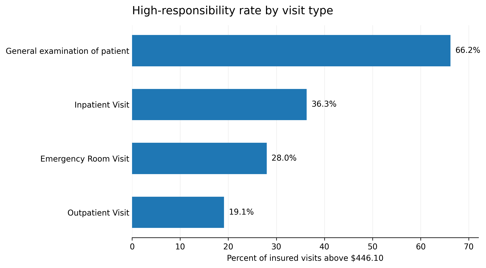
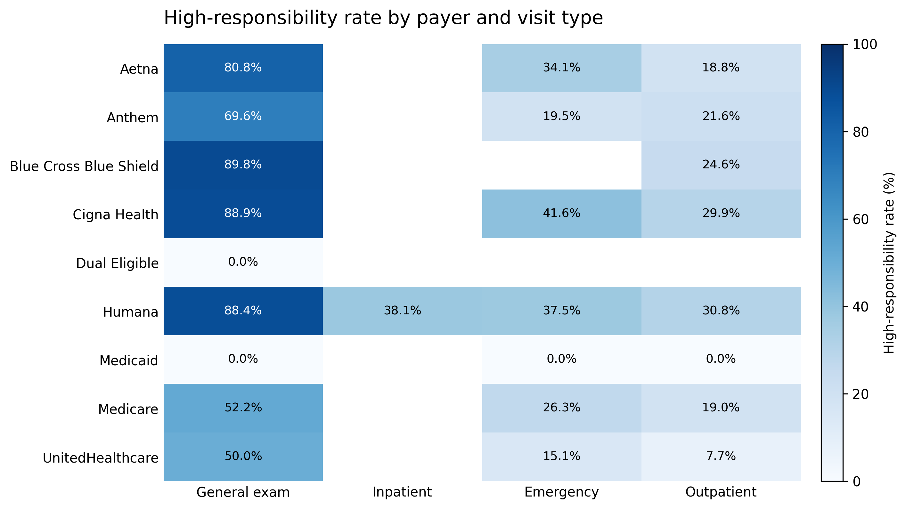
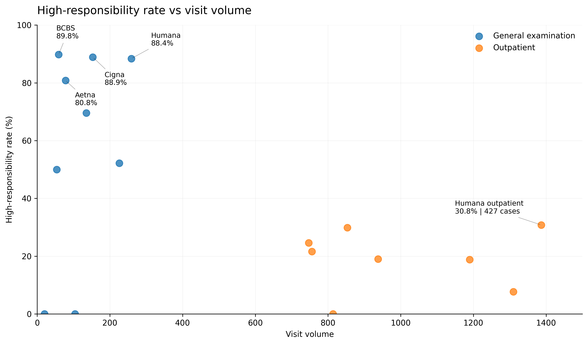

# Healthcare Financial Risk Analysis

## Project Overview

This project looks at patient financial responsibility using synthetic healthcare data.

I used the OHDSI Synthea-to-OMOP pipeline to transform the source data into OMOP CDM v5.4. After checking the transformed tables, I built an analysis dataset using standardized visit and cost data together with payer information.

The analysis focuses on insured patients. I wanted to see whether payer and visit type can help identify visits that may have higher patient financial responsibility before the appointment.

## Business Question

**Which payer and visit-type combinations are associated with higher estimated patient financial responsibility?**

In my current work, insurance eligibility is already checked before the visit, and self-pay patients can receive a cost estimate.

The gap I wanted to look at is insured patients who may still have a high out-of-pocket cost even when their insurance is active.

## Data & Tools

**Data**
- Synthetic healthcare data generated by Synthea
- OHDSI Tutorial-ETL project
- OMOP Common Data Model v5.4

**Tools**
- SQLMesh - ran the Synthea-to-OMOP transformation pipeline
- DuckDB - stored and queried the transformed data
- SQL - data validation, joins, and business analysis
- Python - analysis and data preparation
- Matplotlib - visualization
- Google Colab - development environment

## Workflow

1. Reviewed the raw Synthea tables and checked financial fields and key relationships.
2. Ran the OHDSI SQLMesh pipeline to transform Synthea data into OMOP CDM v5.4.
3. Checked the main OMOP visit and cost tables after the transformation.
4. Combined OMOP visit and cost data with payer information from the staging layer.
5. Built a final analysis dataset with 10,652 records.
6. Compared patient financial responsibility across payer and visit-type groups.
7. Used the 75th percentile ($446.10) as the high-responsibility threshold for insured visits.

## Key Findings

- General examination visits had the highest high-responsibility rate at **66.2%**.
- For BCBS, Cigna, Humana, and Aetna, more than **80%** of general examination visits were above the $446.10 threshold.
- High rate and high volume showed different patterns. General examination groups had very high rates but smaller visit volume.
- Humana outpatient had a lower rate of **30.8%**, but its large volume resulted in **427 high-responsibility visits**.

## Visualizations

### High-Responsibility Rate by Visit Type

General examination visits had a much higher high-responsibility rate than the other visit types.

### Payer and Visit Type

The heatmap shows that the general examination pattern appears across several payers, especially BCBS, Cigna, Humana, and Aetna.

### High Rate vs High Volume

General examination groups show a high-rate, lower-volume pattern. Outpatient groups have lower rates but much larger volume, with Humana outpatient producing 427 high-responsibility visits.

## Business Recommendations

I would use this analysis as an additional financial-risk step after the normal insurance eligibility check.

For payer + visit-type combinations with consistently high rates, an earlier cost estimate or financial message could be considered.

For high-volume groups such as Humana outpatient, I would not flag every visit. More information such as deductible status, plan type, specific service, and expected allowed amount would be needed to identify a smaller and more useful group for review.

The goal is not to create more manual work, but to identify insured patients who may benefit most from earlier financial information.

## Limitations

- The project uses synthetic Synthea data, so the payer and financial patterns should not be treated as real health-system results.
- In this tutorial ETL, estimated patient responsibility is derived from the transformed cost fields and should not be interpreted as actual billed patient balance.
- The current analysis uses payer and visit type as the main risk signals. Real operational use would require additional information such as plan design, deductible status, service details, and allowed amounts.

## Repository Structure

- `healthcare_financial_risk_analysis.ipynb` - full ETL validation, analysis, and visualization
- `data/analysis_dataset.csv` - final analysis-ready dataset
- `images/` - charts used in this README
